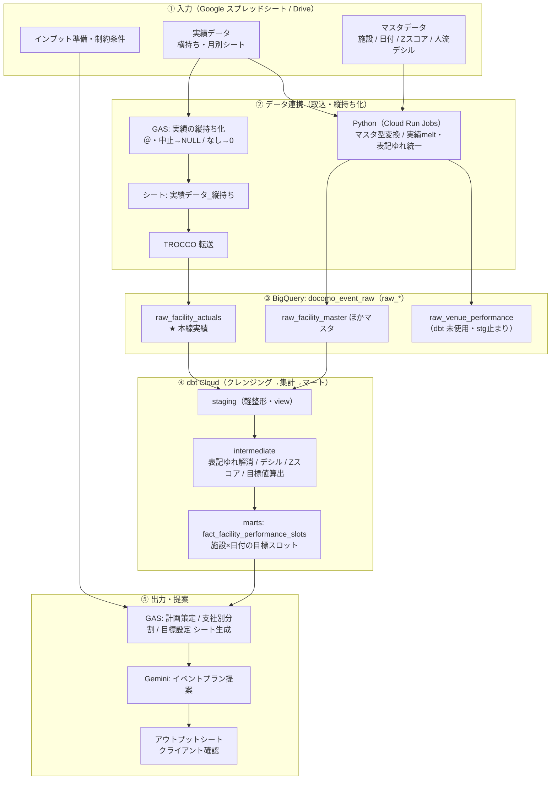

# 現行処理整理（As-Is）— docomo-event-actual-pipeline

BigQuery → Snowflake 移行に向けた、既存処理（GAS / Python / dbt / 連携）の棚卸し。
構成図 `業務フロー図_As-Is`（draw.io）と、リポジトリ内コードの調査結果をもとに整理。

---

## 0. 全体フロー

▶ Mermaid ソース（GitHub / VS Code では図として描画。編集用。画像はこのソースから生成）

### 処理ステップ早見表
| # | 層 | 何をする | 道具 | 入力 → 出力 |
|---|---|---|---|---|
| ① | 入力 | 元データを用意 | スプレッドシート/Drive | 横持ち実績・マスタ・準備/制約 |
| ② | データ連携 | 実績を縦持ち化し、BigQueryへ取込 | GAS＋TROCCO／Python(Cloud Run) | 横持ち実績・マスタ → `docomo_event_raw.raw_*` |
| ③ | raw | クレンジング前の生データ保持 | BigQuery | `raw_facility_actuals`(本線) / `raw_*`マスタ / `raw_venue_performance`(未使用) |
| ④ | dbt | 整形→集計→目標値算出 | dbt Cloud | raw → staging → intermediate → marts(`fact_*`) |
| ⑤ | 出力 | シート生成・AI提案・確認 | GAS＋Gemini | marts → 計画/支社別/目標シート → 提案 → クライアント |

**ポイント**：②で**実績の取込が2系統**（GAS+TROCCO → `raw_facility_actuals`＝本線／Python → `raw_venue_performance`＝dbt未使用）。詳細は「⚠️ 移行前に要確認」を参照。

---

## 1. GAS（Google Apps Script・TypeScript／`gas/apps/`）

| アプリ | 役割 | 入力 | 主ロジック | 出力 |
|---|---|---|---|---|
| **event-actuals-normalizer** | 実績の**縦持ち化**＋クレンジング | 月別横持ちシート（4行目ヘッダ、O〜AS列が日付） | melt（縦持ち化）、日付パース（`yyyy/mm/dd` 等）、値正規化 **`＠/@/中止/確認中→NULL`・`なし→0`** | シート「実績データ_縦持ち化」（13列＝`raw_facility_actuals` と同形） |
| **event-plan-sheet-prep** | 月次の計画/入力/出力シートを自動生成・初期化 | 設定シート群（対象年度/月、各URL、フォルダ/テンプレID） | テンプレ複製、参照URL・年月情報の一括更新 | Drive 上に「N月分」フォルダ＆シート群（準備/インプット/アウトプット） |
| **branch-target-sheet-builder** | 計画策定シートを**支社別に分割** | 「計画策定シート（仮）のFB版_5パターン分」（13行目〜、支社=6列目/支店=7列目） | 支社でグループ化し、各支社SSへコピー＆貼付、不要行削除 | 各支社の「計画策定シート_◯◯」（10支社：北陸/北海道/東北/東海/中国/首都圏/四国/九州/関西/関信越） |

- 実行：いずれも手動関数実行（メニュー/手動想定）
- 外部依存：Google Drive（支社別/テンプレ各SSのURL・フォルダID）。BigQuery 直接アクセスは無し。

---

## 2. Python パイプライン（Cloud Run Jobs／`main.py`・`src/`）

- **役割**：Google スプレッドシート → 変換 → BigQuery ロード
- **実行環境**：Docker 化 → Cloud Build（build → Artifact Registry → Cloud Run Jobs デプロイ）。Python 3.13 / Poetry。
- **認証**：`APP_ENV=local` はサービスアカウントキー、それ以外は ADC。
- **書き込みモード**：`WRITE_TRUNCATE`（毎回洗い替え）
- **制御**：`SHOULD_UPDATE_ALL_DIMENSIONS=true` でマスタ全更新、false で実績のみ。

### 入力（環境変数で 7 シート ID）
施設マスタ / 施設統計マスタ / 日付マスタ(2025-2026) / 日付マスタ(2026-2027) / 施設別Zスコア / 人流デシル / イベント実績

### Transformer
- **MasterTransformer**（マスタ5種）：2行目をヘッダ採用 → スキーマ定義に基づき型変換（STRING/INT/BOOL/DATE）
- **EventActualTransformer**（実績）：全シート結合 → 施設名の**表記ゆれマッピング**（施設マスタの「表記ゆれマスタNo付与」）→ **melt（縦持ち）** → `＠/@/中止/確認中→NA`・`なし→0` → カンマ除去・数値化・round → Int64、(date, facility_name) でソート

### 出力テーブル（`schema` 定義）
| テーブル | 列数 | 概要 |
|---|--:|---|
| facility_master | 71 | 施設コード/名/カテゴリ/PO/支社支店/各種フラグ |
| facility_statistics_master | 356+ | 1〜10km圏の人口・世帯・収入・セグメント（**dbt未使用**） |
| date_master_2025_2026 / 2026_2027 | 12 | 祝日/週番/曜日/フラグ |
| facility_daily_deviation_zscore | 7 | 施設×日付フラグのZスコア |
| facility_foot_traffic_sum_and_decile_by_flag | 18 | フラグ別 人流合計＋デシル区分 |
| venue_performance | 33 | 縦持ち実績（**dbt未使用＝行き止まり**。全NULL12列を含む） |

> `run_pipeline` の流れ：`GoogleSpreadSheetsRepository.fetch_spreadsheets` →（gspread→pandas）→ `Transformer.run`（transform→欠損列補完→型整列）→ `BigQueryRepository.save_table`（スキーマ順整列・WRITE_TRUNCATE）

---

## 3. BigQuery raw 層（dbt ソース：`docomo_event_raw`）

`raw_facility_master` / `raw_date_master`(+`_2025_2026`,`_2026_2027`) / `raw_facility_daily_deviation_zscore` / `raw_facility_foot_traffic_avg_and_decile_by_flag` / `raw_facility_name_mappings` / `raw_facility_actuals`（本線実績） / `raw_venue_performance`（未使用実績）

---

## 4. dbt（`docomo_event/`）

レイヤー：`source → staging(view) → intermediate(table) → marts(table)`。
カスタムスキーマ命名 macro により `docomo_event_staging / _intermediate / _mart` に分離。

### staging（軽整形）
rawを `TRIM(facility_name)` 等で整える／一部はそのまま通過。

### intermediate（主要ロジック）
| グループ | モデル | 処理 |
|---|---|---|
| actuals | int_facility_actuals | 表記ゆれ解消 `COALESCE(mapped_name, original_name)` |
| actuals | int_facility_daily_actual | facility_master と INNER JOIN で `facility_code`・属性付与、date_master で日付属性付与（施設×日別） |
| mappings | int_facility_event_decile_mapping | デシル列を **UNPIVOT**（9フラグ：GW/お盆/三連休/正月/通常土日/年末/飛び石/平日/ブラックフライデー） |
| benchmarks | int_benchmark_periods | 3期間を手動 UNION ALL（3ヶ月/5ヶ月/12ヶ月） |
| benchmarks | int_facility_event_decile_avg_actual | 期間 BETWEEN 結合＋デシル付与 → facility_code×date_flag×decile で COUNT/SUM/AVG |
| benchmarks | int_event_decile_benchmark | **`PERCENTILE_CONT` で p10〜p90**（macro）＋ `MAX() OVER` で max_performance |
| deviation_zscore | int_facility_monthly_weekday_dateflag_deviation_zscore | Zスコアを facility×month×week×flag で平均 |
| deviation_zscore | int_facility_monthly_dateflag_deviation_zscore | 上記から week を外して再集計 |
| planning | int_facility_event_planning_snapshot | CROSS JOIN（施設×期間×フラグ）＋各種 LEFT JOIN ＋ CASE で **standard_target / challenge_target**（p50→…→max、`GREATEST(…,1)`） |

### marts（最終アウトプット）
- `fact_facility_performance_slots`（＋ `_2025_2026` / `_2026_2027`）
- 施設 × 日付（月×週×date_flag）の**目標スロット**。標準/チャレンジ目標と、Zスコアで季節調整した `*_seasonal` を出力。

### macros
- `calculate_percentile_by_period_flag_rank`：`PERCENTILE_CONT(... ) OVER (PARTITION BY period, date_flag, decile_rank)`（分位計算）
- `generate_schema_name`：`target.schema` に `_staging/_intermediate/_mart` を付与

---

## 5. 出力（下流）

dbt マート → ④ 各種シート生成 GAS（計画策定シート / 支社別分割 / 目標設定）→ ⑤ Gemini にイベントプラン提案 → アウトプットシートへ貼付してクライアント確認。

---

## ⚠️ 移行前に要確認（静的コードだけでは確定できない）

1. **2系統の縦持ち実績が併存**
   - `raw_facility_actuals`（GAS 縦持ち → TROCCO、**dbt で使用＝本線**）
   - `raw_venue_performance`（Python 縦持ち、**dbt 未使用＝行き止まり**。全NULL12列もここ）
   - → どちらが正か、**Python版 venue_performance を廃止できるか**を確認。
2. **データセット/テーブル名の不一致**
   - Python は `docomo_eventActual.{facility_master,…}`（`raw_` 無し）に書き込む一方、dbt は `docomo_event_raw.raw_*` を参照。
   - → 間に **TROCCO 等のリネーム転送**がある想定。実体を要確認。
3. **TROCCO の転送定義がリポジトリ外（GUI管理）**
   - 移行で最も不明な領域。設定のエクスポート取得を推奨。
4. **`raw_facility_statistics_master`（356列）は Python ロードされるが dbt 未使用**。
5. **重複・品質メモ**（データプロファイリング結果より）
   - `raw_facility_actuals`：完全重複54件、facility_name 孤児36,783件（マスタ未登録施設あり）、直近月ほど未記入増。
   - `raw_venue_performance`：完全重複147件（ほぼ2施設）、全NULL12列（未投入）。ただし dbt 未使用のため現状の分析影響なし。
   - `raw_facility_name_mappings`：以前の重複4件は解消済み（935行・重複0）。

---

## Snowflake 移行の主要論点（dbt SQL）

| 要対応 | 箇所 | 対応方針 |
|---|---|---|
| `SELECT * EXCEPT(col)` | stg 各種 | Snowflake は `EXCLUDE`（または明示列） |
| `UNPIVOT` 構文差 | int_facility_event_decile_mapping | Snowflake 構文に書換 |
| `PERCENTILE_CONT() OVER` | macro | Snowflake の OVER 対応を検証 |
| `DATE 'YYYY-MM-DD'` リテラル | int_benchmark_periods | `'…'::DATE` |
| 型（`FLOAT64`/`INT64`） | macro/各所 | `FLOAT`/`NUMBER` |
| データロード基盤 | Python(Cloud Run) ＋ TROCCO | Snowflake 向け（Snowpipe/COPY/外部連携 等）へ再設計 |
| 大半の標準SQL（JOIN/CASE/COALESCE/GREATEST/集計/ウィンドウ/EXTRACT 等） | 全般 | 概ね互換 |

---

## 次アクション候補
1. To-Be（Snowflake 版）構成案の作成
2. TROCCO 転送定義の棚卸し（不明領域の解消）
3. 移行スコープ決定（特に「2系統の縦持ち」「データセット名不一致」の認識合わせ）

---
*作成: データプロファイリング/コード調査に基づく As-Is 棚卸し（生成時点のスナップショット）。*
